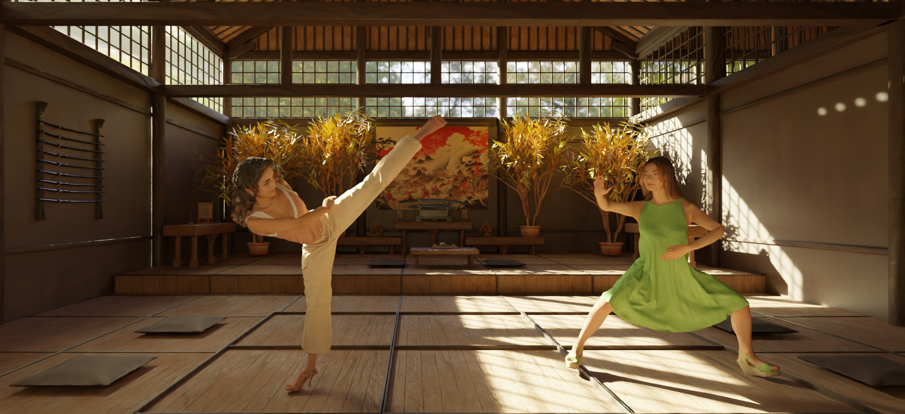

# PhysAvatar: Learning the Physics of Dressed 3D Avatars from Visual Observations 


[[Paper]](https://arxiv.org/abs/2404.04421) [[Project Page]](https://qingqing-zhao.github.io/PhysAvatar
)
### News
* Released the code for mesh tracking, garment physical parameter estimation, and test time animation.
* Release the code for apperance fitting and rendering.

[//]: # (### TODO)

[//]: # (* Release the tutorial for animating the character using MIXAMO data.)
## Quick Start
### Installation
We suggest to use conda with mamba to set up the environment. The following commands will create a new conda environment with required dependencies installed.
```bash
mamba env create -f environment.yml
conda activate phys_avatar
# install gaussian rasterization
git clone https://github.com/JonathonLuiten/diff-gaussian-rasterization-w-depth.git
cd diff-gaussian-rasterization-w-depth
python setup.py install
pip install .
# install Codim-IPC
cd Codim-IPC
python build.py
```
Download our [pre-processed data](https://drive.google.com/file/d/1N8xQtnG6supLulLPr0IQa9TuN2FHrgBt/view?usp=sharing) (cloth mesh, fitted SMPLX model) for Actor1 from ActorsHQ dataset. 
Download [ActorsHQ dataset](https://actors-hq.com/) (Actor1, Sequence 1, 4x downsampling videos) under the `data` folder. 
Download [SMPLX npz and pkl files](https://download.is.tue.mpg.de/download.php?domain=smplx&sfile=models_smplx_v1_1.zip) and [VPoser pretrained weights](https://download.is.tue.mpg.de/download.php?domain=smplx&sfile=vposer_v1_0.zip), and put them under `data` folder, following the structure as `data/body_models/smplx/*.npz` and `data/body_models/TR00_E096.pt`.

### Mesh Tracking
```bash
bash scripts/train_mesh_lbs.sh
```
We suggest using [wandb](https://wandb.ai/home) to visualize the training process. Replace `--wandb_entity xxxx` in the bash file with your wandb entity.

### Garment Physical Parameter Estimation
We first extract the garment mesh from the mesh tracking results:
```bash
python extract_cloth.py --train_dir ./output/exp1_cloth/a1_s1_460_200 --seq a1_s1 --cloth_name cloth_sim.obj
```
Then we estimate the physical parameters:
```bash
bash scripts/phys_param_estimation.sh
```
Note that in the simulation we manually segment out the garment from the fullbody mesh (`data/a1_s1/cloth_sim`) and define the boundry condition points which drives the simulation. We provide the boundry condition points (`data/a1_s1/dress_v.txt`) for Actor1. 

If you are working on custom data, you need to prepare those files yourself. Following [data preparation](data/README.md) for more details.

### Animation
We first compute the LBS weights for the fullbody mesh using algorithm described in [Robust Skin Weights Transfer via Weight Inpainting](https://www.dgp.toronto.edu/~rinat/projects/RobustSkinWeightsTransfer/index.html):
```bash
python lbs_weights_inpainting.py
```
The optimized weights are saved in `data/a1_s1/optimized_weights.npy`. 
We use the weights to animate human body, and the garment dynamics are simulated by Codim-IPC. For motions from ActorsHQ dataset, run:
```bash
python run_sim_actorhq.py
``````
For motion in AMASS dataset, run:
```bash
python run_sim_amass.py --motion_path ./data/AMASS/MoSh/50020/shake_hips_stageii.npz --frame_num 50
```

For motion in other formats, we take MIXAMO data as an example. 
The basic logic is to obtain the animated mesh sequences of garment and the underlining human body, 
and the rest is simulation part which is discussed as above. 
To use mixamo motion, follow these instructions: 
(a) combine the human mesh and smplx in blender into single mesh and export to obj; 
(b) upload the obj mesh to mixamo, use auto rigging to rig it, then choose any motion to animate the sequence, and download the fbx file; 
(c) import fbx file to blender, separate the human mesh and smplx mesh, export the obj sequences; (d) extract garment part from the full-body human mesh sequence, and use the garment and smplx mesh for simulation.


### Inverse Rendering
Check `pbr/README.md` for more details.

## Evaluation
Find all the preprocessed data [here](https://drive.google.com/drive/folders/1Fl_WqNXAnZbAOHJwbcav5FYvFSLbh6OQ). 
Use Cam007 and Cam127 for evaluation, and the first 200 frames for training and the next 200 frames for evaluation where the first frame idx is related to the FrameRec{start_id}.obj file (except for the Actor 3 sequence where we don't use frames after 720 since our SMPLX estimation is not accurate due to large occlusions).  
# Citation
If you use this code or our data for your research, please cite:

PhysAvatar: Learning the Physics of Dressed 3D Avatars from Visual Observations. Yang Zheng, Qingqing Zhao, Guandao Yang, Wang Yifan, Donglai Xiang, Florian Dubost, Dmitry Lagun, Thabo Beeler, Federico Tombari, Leonidas Guibas, Gordon Wetzstein. In ECCV 2024.

Bibtex:

```bibtex
@inproceedings{PhysAavatar24,
    title={PhysAvatar: Learning the Physics of Dressed 3D Avatars from Visual Observations},
    author={Yang Zheng and Qingqing Zhao and Guandao Yang and Wang Yifan and Donglai Xiang and Florian Dubost and Dmitry Lagun and Thabo Beeler and Federico Tombari and Leonidas Guibas and Gordon Wetzstein}
    journal={European Conference on Computer Vision (ECCV)},
    year={2024}
}
```
